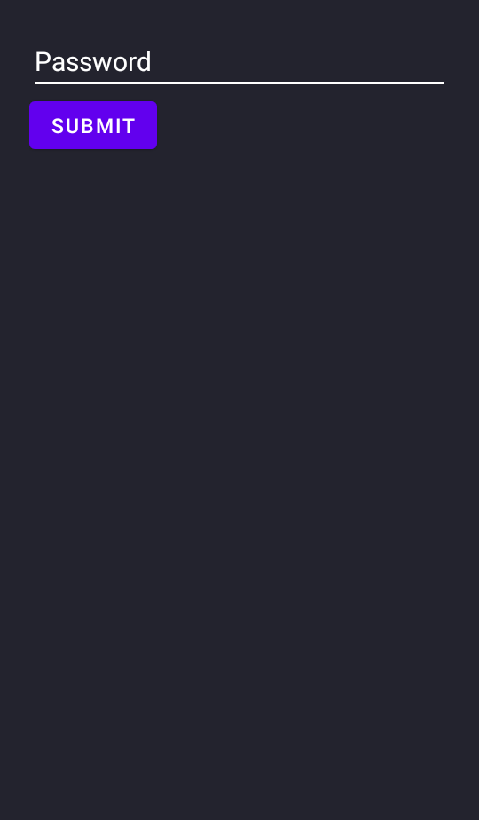
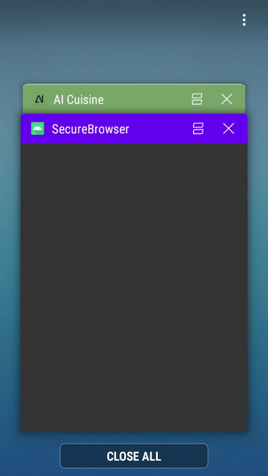

# SecureBrowser

A password protected browser with history. Inspired by "Samsung Internet" browser's "secret mode" which is a password protected incognito mode. 

## Features
- Password based login
- View videos in fullscreen (See for credits)
- Privacy guard in Recent Apps
- No Screenshots
- Dot Commands

## Dot Commands
Dot commands are basic bindings to features like history, help etc. Currently the following are supported:
- .hist -> Views history

## Screenshots of the app

### Password Insert Screen:

### No Screenshots and Privacy guard

### Website Controls

The left button goes backwards while the right one goes to the URL (NOT Forward)

## TODO
- Change password
- Hash password
- Logo

Feel free to send patches via Pull Requests or file a Issue if something doesnt work :)

## Credits
[VideoWebChromeClient.java](https://github.com/cprcrack/VideoEnabledWebView/) -> inspired from cprcrack

## LICENSE
SecureBrowser is licensed under the GPL-3.0 license.
